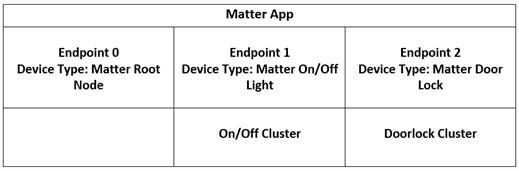
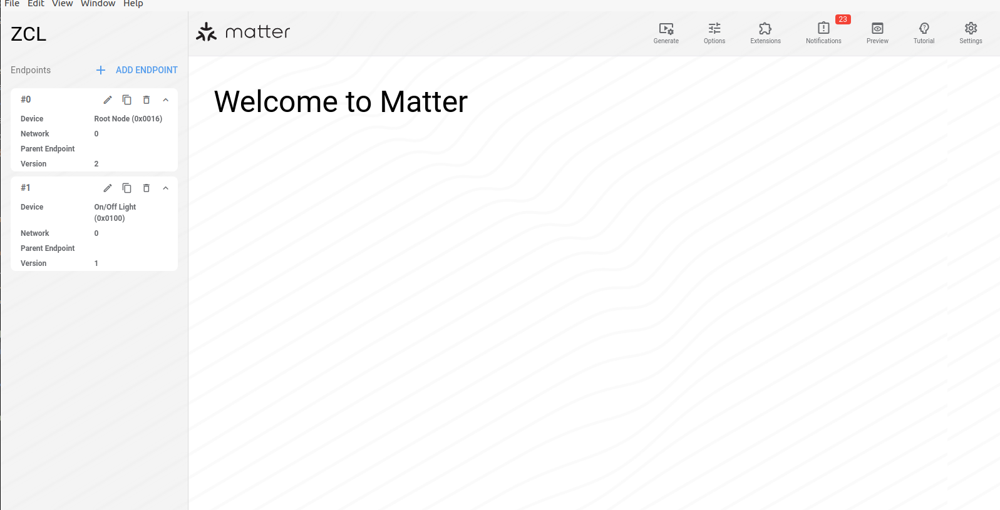
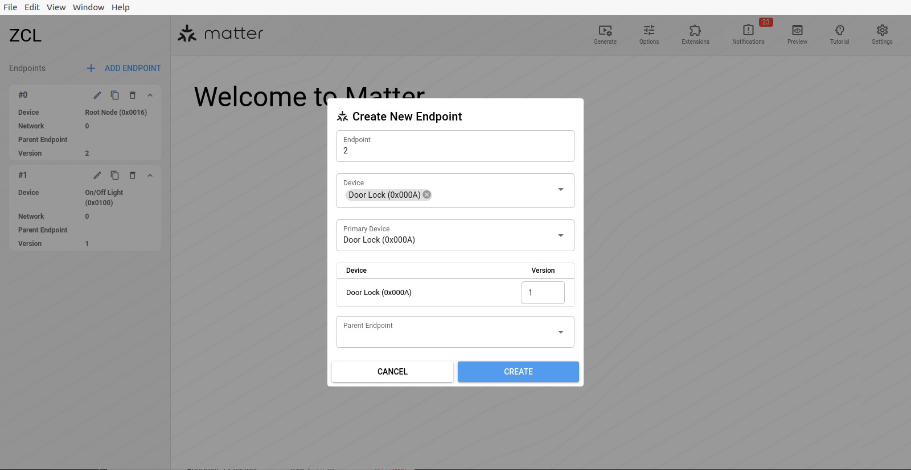
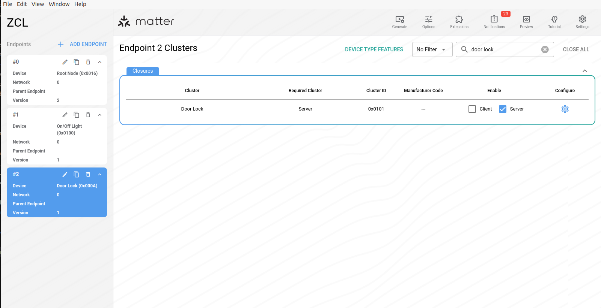
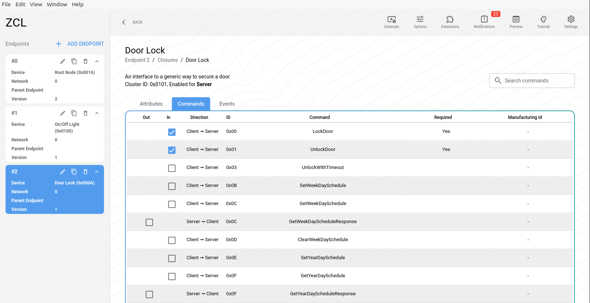
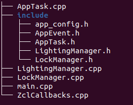

# NXP Application Code Hub
[](https://www.nxp.com)

## Door Lock Cluster integration on a Lighting App Matter Application using K32W061 DK6

This example demo describes the process of adding and executing a Door Lock Cluster to an already existing Matter Lighting App running on the NXP K32W061 DK6 development kit. It highlights the changes added to the Matter Lighting application, while also showing the required cluster configuration using the ZAP Platform.  Both examples are based on the [connectedhomeip](https://github.com/project-chip/connectedhomeip/tree/v1.4.0.0) repository, so the user will need to go over the whole process of cloning and setting up the environment as described in the original README. This demo only contains the folders and files that must replace the original ones from the lighting app example. <br />

#### Boards: IOTZTB-DK006
#### Categories: Wireless Connectivity
#### Peripherals: Bluetooth, USB
#### Toolchains: GCC

## Table of Contents
1. [Software](#step1)
2. [Hardware](#step2)
3. [Setup](#step3)
    1. [Solution Overview](#step4)
    2. [Cluster Configuration using ZAP](#step5)
    3. [Changes in implementation](#step6)
    4. [Building](#step7)
    5. [Flashing the board](#step8)
    6. [Commissioning the device](#step9)
4. [Results](#step10)
5. [Support](#step11)
6. [Release Notes](#step12)

## 1. Software<a name="step1"></a>
The development is based on the connectedhomeip (CHIP) open-source project, version v1.4.0.0, and targets the NXP K32W061 SDK development kit. This repository contains the Lighting App example folder from the original *connectedhomeip/examples/lighting-app/nxp/* repository with all modified files required to add the Door Lock Cluster to it.

The supported environments in order to build and develop are Ubuntu 20.04 or Ubuntu 22.04 version. The build system uses gn and ninja for building the project. The necessary prerequisites for Ubuntu environments can be installed following the steps from this [README](https://github.com/project-chip/connectedhomeip/blob/v1.4.0.0/docs/guides/BUILDING.md).

For flashing the application on the K32W061 board, [MCUXpresso IDE](https://www.nxp.com/design/design-center/software/development-software/mcuxpresso-software-and-tools-/mcuxpresso-integrated-development-environment-ide:MCUXpresso-IDE) or DK6Programmer tool can be used.

## 2. Hardware<a name="step2"></a>
This demo requires the following hardware setup:

- [K32W061 DK6](https://www.nxp.com/products/wireless-connectivity/multiprotocol-mcus/advanced-development-kit-for-k32w061-and-jn5189-88:IOTZTB-DK006) development kit with a Generic Expansion Board OM15082-2
- Controller that will commission and control the device. This demo was implemented using a Raspberry Pi 4 as the controller
- SD Card for the Raspberry Pi with a Matter specific image and OTBR implementation
- NORDIC Dongle used to create the Thread network between the node and the controller

## 3. Setup<a name="step3"></a>

Use the following steps to get the environment set up. In case of trouble when activating the Matter virtual environment, [here](https://github.com/project-chip/connectedhomeip/blob/v1.4.0.0/docs/guides/BUILDING.md) can be found all requirements related to the Matter repo.

After cloning the [connectedhomeip](https://github.com/project-chip/connectedhomeip/tree/v1.4.0.0) repository, it is needed to checkout NXP specific submodules only:

```shell
user@ubuntu: ~/connectedhomeip$ scripts/checkout_submodules.py --shallow --platform nxp --recursive
```

To activate the environment:
```shell
user@ubuntu: ~/connectedhomeip$ source scripts/activate.sh
```

To initialize/update the NXP SDK:

```shell
user@ubuntu: ~/connectedhomeip$ third_party/nxp/nxp_matter_support/scripts/update_nxp_sdk.py --platform k32w0
```

All the steps from above are taken directly from the [README](https://github.com/project-chip/connectedhomeip/tree/v1.4.0.0/examples/lighting-app/nxp/k32w0) file for the Lighting Application.

### 3.1 Solution Overview<a name="step4"></a>

The open-source Matter standard enables the use of Clusters and Endpoints for different applications. In this case, the starting point is represented by the Lighting App example. As shown in the figure below, besides the first 2 endpoints: *Endpoint 0* with *Device Type - Matter Root Node* and *Endpoint 1* with *Device Type - Matter On/Off Light* – originally from Lighting App, a third endpoint is added – *Endpoint 2* with *Device Type - Matter Door Lock*. Both applications are based on Project CHIP and the NXP K32W SDK, and support remote access and control of a light bulb or door lock over a low-power, 802.15.4 Thread network.

[](images/zap_starting_page.png)

### 3.2 Cluster Configuration using ZAP<a name="step5"></a>

**Overview of the ZAP Platform**

The ZAP Platform represents a generic engine and user interface for applications and libraries based on Zigbee Cluster Library. It is used to configure and create Matter Clusters, as it provides features for Matter apps and SDKs, such as: configuring endpoints, clusters, attributes; creating templates that automatically generate Data Model definitions and Matter source code.

More information and steps on how to install ZAP [here](https://developers.home.google.com/matter/tools/zap).

**Adding the Door Lock Cluster**

This demo uses the original .zap file from the Lighting App Example that doesn't have the Door Lock Cluster. The zap folder attached to this repository contains the already modified .zap file, that should result after doing the steps below.

After starting the ZAP Platform, first step is to load the lighting-on-off.zap file.

- File -\> Open file -\> Select the lighting-on-off.zap file from the downloaded Matter repository.

[](images/zap_starting_page.png)

Next step is adding a new endpoint and configuring it as a Door Lock application.

- Add Endpoint -\> in the "Create New Endpoint" pop-up box select the Device type "Matter Door Lock" -\> Create

[](images/zap_create_endpoint.png)

After creating the new endpoint, the main focus is on the Door Lock Cluster. One needs to check its Attributes, Commands and Events in order to see that everything is configured the correct way for the application.

- Search for the "Door Lock" cluster

[](images/zap_doorlock_cluster.png)

- Configure -\> Commands -\> check that LockDoor and UnlockDoor commands are enabled

[](images/zap_doorlock_commands.png)

- Lastly, the new file needs to be saved in the connectedhomeip repository, at path: */connectedhomeip/examples/lighting-app/nxp/zap*.

### 3.3 Changes in implementation<a name="step6"></a>

The source and header files used for the Matter examples can be found at path: *connectedhomeip/examples/lighting-app/nxp/k32w0* in the main Matter repository. The user must replace the files from the original repository with the following:
- *main/* folder (replacing *connectedhomeip/examples/lighting-app/nxp/k32w0/main/*)
- *zap/* folder (replacing *connectedhomeip/examples/lighting-app/nxp/zap/*)
- *args.gni* file (replacing *connectedhomeip/examples/lighting-app/nxp/k32w0/args.gni*)
- *BUILD.gn* file (replacing *connectedhomeip/examples/lighting-app/nxp/k32w0/BUILD.gn*)

The structure of the *main/* directory can be seen in the figure below.

[](images/source_files_structure.png)

The ZCLCallback.cpp file together with the AppTask.cpp manage to create the workflow of the program. The LightingManager file consists of declarations and implementations of structures and functions specific for the Lighting App Cluster.

Originally, all files contained only functions referring to the Lighting App. The goal is to transform those files into an application that also accepts and responds to Door Lock actions and commands, by adding new implementations and features.

Similarly with the LightingManager file, the demo also need a LockManager implementation to handle the Door Lock clusters and commands. This one contains functions like SetLockState, ExecuteCallback, GetLockState.

The AppTask.cpp file represents the main part of the application. Here are implemented functions and actions that involve both the Lighting and Lock Apps, starting with some initializations and going all the way to LEDs blinking, turning them on or off, depending on the commands. The main focus is on the LockManagerCallback function, that receives an event – LockStarted, LockComplete, UnlockStarted, UnlockComplete, and controls LED D2 on the expansion board.

More details about the new functions can be seen in the source files in this repository.

### 3.4 Building<a name="step7"></a>

After modifying the source files, a new binary file can be generated following these steps.

```shell
user@ubuntu: ~/connectedhomeip$ cd examples/lighting-app/nxp/k32w0
user@ubuntu: ~/connectedhomeip/examples/lighting-app/nxp/k32w0$ gn gen out/debug/
user@ubuntu: ~/connectedhomeip/examples/lighting-app/nxp/k32w0$ ninja -C out/debug
```

Note that option `chip_enable_ota_requestor` in file args.gni is disabled due to flash size constraints.

The resulting output file can be found in *out/debug/chip-k32w0x-light-example*.

### 3.5 Flashing the board<a name="step8"></a>

To flash the *chip-k32w0x-light-example.bin* binary follow the instructions presented in [README](https://github.com/project-chip/connectedhomeip/tree/v1.4.0.0/examples/lighting-app/nxp/k32w0#flashing-and-debugging). If the DK6Programmer alternative is chosen, one has to take into consideration that chip_enable_ota_requestor is set to false, so the address offset needs to start from 0x0 when flashing.

### 3.6 Commissioning the device<a name="step9"></a>

Assuming the building and flashing were successful on the K32W061 DK6 board, next step is the commissioning part.

When using a Raspberry Pi controller, it is recommended to have an Ubuntu 20.04 or Ubuntu 22.04 version. The chip-tool binary can be obtained by building the chip-tool application from *connectedhomeip/examples/chip-tool*. Building the example can be done from the root folder using the command `scripts/examples/gn_build_example.sh examples/chip-tool FULL-PATH/`, which puts the binary at *FULL-PATH/chip-tool*. One needs to replace FULL-PATH with the desired path instead. After that, it is necessary to copy the resulted chip-tool binary on the Raspberry Pi device. It will be used for commissioning and sending commands to the node.

- Execute the OTBR script
  - This script will output a dataset string

- Commission the K32W061 board to the Matter controller
  - Before this step it is necessary to put the board in *Advertising Mode*, which for this example it can be done by pressing the *USER INTERFACE* button

```shell
user@ubuntu: ~$ sudo ./chip-tool pairing ble-thread node_id hex:dataset 20202021 3840
```
  - *node_id* needs to be specified by the user
  - *dataset* represents the dataset hash resulted after executing the OTBR script

Now the K32W061 board and the Raspberry Pi controller are commissioned and can communicate in the network.

## 4. Results<a name="step10"></a>

After commissioning, the user can control both applications from the same node using the following commands. The effects of the commands will be reflected in LEDs D2 (for the Lock App example) and D3 (for the Lighting App example). The commands will be run on the Matter controller (Raspberry Pi).

The toggle command for the Lighting App:

```shell
user@ubuntu: ~$ sudo ./chip-tool onoff toggle node_id endpoint_id
```
  - *node_id* - use the one given at commissioning step
  - *endpoint_id* is 1

Instead of the *toggle* command one can also use *on* or *off* commands.

The commands for the Door Lock App:

- lock-door action

```shell
user@ubuntu: ~$ sudo ./chip-tool doorlock lock-door node_id endpoint_id --timedInteractionTimeoutMs 100
```

- unlock-door action

```shell
user@ubuntu: ~$ sudo ./chip-tool doorlock unlock-door node_id endpoint_id --timedInteractionTimeoutMs 100
```
  - *node_id* - use the one given at commissioning step (the same used also for the lighting commands)
  - *endpoint_id* is 2

## 5. Support<a name="step11"></a>
*Provide URLs for help here.*

#### Project Metadata

<!----- Boards ----->
[](https://www.nxp.com/products/wireless-connectivity/multiprotocol-mcus/advanced-development-kit-for-k32w061-and-jn5189-88:IOTZTB-DK006)

<!----- Categories ----->
[](https://mcuxpresso.nxp.com/appcodehub?category=wireless_connectivity)

<!----- Peripherals ----->
[](https://mcuxpresso.nxp.com/appcodehub?peripheral=bluetooth)
[](https://mcuxpresso.nxp.com/appcodehub?peripheral=usb)

<!----- Toolchains ----->
[](https://mcuxpresso.nxp.com/appcodehub?toolchain=gcc)

Questions regarding the content/correctness of this example can be entered as Issues within this GitHub repository.

>**Warning**: For more general technical questions regarding NXP Microcontrollers and the difference in expected functionality, enter your questions on the [NXP Community Forum](https://community.nxp.com/)

[](https://www.youtube.com/NXP_Semiconductors)
[](https://www.linkedin.com/company/nxp-semiconductors)
[](https://www.facebook.com/nxpsemi/)
[](https://x.com/NXP)

## 6. Release Notes<a name="step12"></a>
| Version | Description / Update                           | Date                        |
|:-------:|------------------------------------------------|----------------------------:|
| 1.0     | Initial release on Application Code Hub        | March 10<sup>th</sup> 2025 |

## Licensing

*If applicable - note software licensing here with links to licenses, otherwise remove this section*

## Origin

*if applicable - note components your application uses regarding to license terms - with authors / licenses / links to licenses, otherwise remove this section*